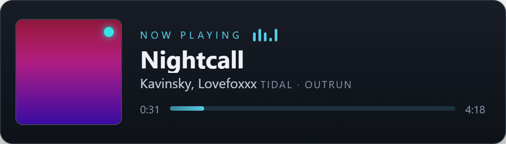

# Cadence — Now Playing widget for OBS

A clean, **rebrandable "now playing" music widget** for OBS browser sources. It shows
the track, artist, album art, and a live progress bar for **Tidal, VLC, Spotify (free
accounts too), Apple Music — or anything on Windows' media controls** — with no
accounts, no OAuth, and no bespoke backend.

> **Name is a working title.** Rename freely — it appears only in this README,
> `package.json`, and `LICENSE`.



## Why it's different

- **Any player, no subscription tier required.** It reads the **OS media session**
  (Windows SMTC, via the free [Tuna](https://obsproject.com/forum/resources/tuna.843/)
  plugin), *not* a music service's API. So it works with **free Spotify**, Tidal,
  Apple Music, YouTube Music, Deezer, foobar2000 — anything that shows in the Windows
  media popup. (This sidesteps the Spotify-API "Premium required" problem entirely.)
- **Accurate progress.** SMTC only reports a track's position on play/pause/seek, so
  the widget **extrapolates** the live position from Tuna's timestamp — the bar glides
  smoothly instead of freezing.
- **Rebrandable in minutes.** The whole look is driven by a dozen CSS variables — see
  **[docs/THEMING.md](docs/THEMING.md)** to make it yours.
- **No backend, no accounts, local-only.** One HTML file + the Tuna plugin.

> **Which streaming apps?** The widget is a plain web page and renders in any Chromium
> browser source — OBS, **Meld Studio**, Streamlabs Desktop, XSplit. Its default data
> feed, **Tuna, is an OBS plugin**, so OBS is the simplest home. For a **non-OBS
> broadcaster** (Meld, …), swap in the **Streamer.bot adapter** — the same widget, fed
> over Streamer.bot's local WebSocket instead of Tuna. See
> **[docs/STREAMERBOT-SETUP.md](docs/STREAMERBOT-SETUP.md)**.

## Quick start

1. **Install and set up Tuna** (the streamer's side of the data) — full steps in
   **[docs/TUNA-SETUP.md](docs/TUNA-SETUP.md)**. In short: install Tuna, set its
   **Source** to *Windows Media Control* and pick your player (e.g. Tidal/Spotify), and
   enable Tuna's **Web server** output (default port `1608`).
2. **Configure the widget.** Open `now-playing-560x160.html` and edit the block near the
   bottom:
   ```js
   window.__NP = {
     source: 'Tidal',       // label + dot: 'Tidal' | 'VLC' | 'Spotify' | 'Apple Music' | ''
     tunaHost: '127.0.0.1',
     tunaPort: 1608,
   };
   ```
3. **Add it to OBS** as a **Browser Source** → check **Local File** → pick the HTML,
   size 560×160. Done.

> **Why edit the file instead of using a URL?** OBS "Local File" sources can't take
> `?query=` params. If you serve the widget over `http://` instead (see below), you can
> use `?source=Tidal&tunaPort=1608…` and they override the block.

## Configuration reference

Set these in the `window.__NP` block (for local files) **or** as URL params (when served
over http — URL params win):

| Key | Default | Meaning |
|---|---|---|
| `source` | `''` | Source label + dot color (`Tidal`, `VLC`, `Spotify`, `Apple Music`, `Deezer`, `YouTube Music`, `Amazon Music`). `''` = no chip. |
| `tunaHost` | `127.0.0.1` | Tuna web server host |
| `tunaPort` | `1608` | Tuna web server port |
| `pollMs` | `1000` | How often to poll Tuna |
| `debug` | `false` | Log Tuna's raw JSON + the mapped track to the browser console |

## Re-skinning / your own branding

The renderer is theme-agnostic — reskinning is **CSS variables only, no JS**. Change
~6 values for a client's palette; more for a full custom look. The complete guide, with
a variable reference and worked example themes, is in **[docs/THEMING.md](docs/THEMING.md)**.

## Hosting it over http (optional)

You don't need a web server — the Local File + config block covers OBS. But if you want
URL params or to push updates to many overlays from one URL, serve the folder over
**http** (not https, to avoid a mixed-content block on `http://localhost:1608`):
Streamer.bot's HTTP server, Tuna's own web server, or any static server all work.

## How it works

`now-playing-560x160.html` is a pure renderer exposing
`window.setNowPlaying({title, artist, album, source, dot, art, duration, elapsed, playing})`.
An **adapter** feeds it — swapping the adapter is the only thing needed to change source:

- **`client/tuna.js`** (default) polls Tuna's JSON (`http://<host>:<port>/` + `/cover.png`).
- **`client/nowplaying-sb.js`** subscribes to Streamer.bot's WebSocket instead — for
  Meld / non-OBS broadcasters where Tuna can't run
  (**[docs/STREAMERBOT-SETUP.md](docs/STREAMERBOT-SETUP.md)**; SB-side relays in
  `streamerbot/`).

Both normalize + extrapolate the live position identically. See
[docs/THEMING.md](docs/THEMING.md) for the full contract.

## Compatibility & caveats

- **Windows** (SMTC). Tuna also runs on Linux (MPRIS); the source auto-labels are
  Windows-flavored but the widget is OS-agnostic.
- **Metadata varies by app.** The widget shows whatever the source publishes to SMTC —
  some apps omit the album or artwork.
- **Tuna reads one source at a time.** "Windows Media Control" covers most desktop apps
  (Tidal, Spotify, …); use the "OBS VLC Source" option only for VLC playing *inside* OBS.
- **Non-OBS broadcasters** (Meld Studio, Streamlabs Desktop, XSplit) → use the
  Streamer.bot adapter instead of Tuna. Any-player coverage needs Streamer.bot (Windows)
  and the SMTC relay; the Spotify path shows album art, the SMTC path is text-only.

## Author & support

Built by **Ashe "Flash" Galatine**.

- Email — [AsheJunius@gmail.com](mailto:AsheJunius@gmail.com)
- X — [@AsheJunius](https://x.com/AsheJunius) · BlueSky — [@projectgalatine.com](https://bsky.app/profile/projectgalatine.com)
- Twitch — [FlashGalatine](https://www.twitch.tv/FlashGalatine) · Discord — [Project Galatine](https://discord.gg/K6pRfSvu2Q)
- Support — Patreon [ProjectGalatine](https://www.patreon.com/ProjectGalatine) · CashApp [$ProjectGalatine](https://cash.app/$ProjectGalatine)

MIT licensed — see [LICENSE](LICENSE). Only reads data you already have locally; no
accounts or telemetry.
