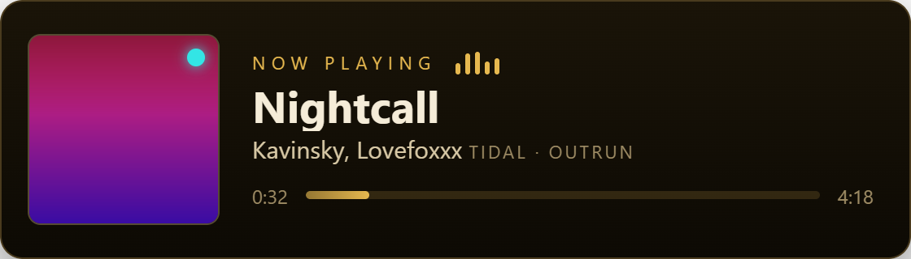
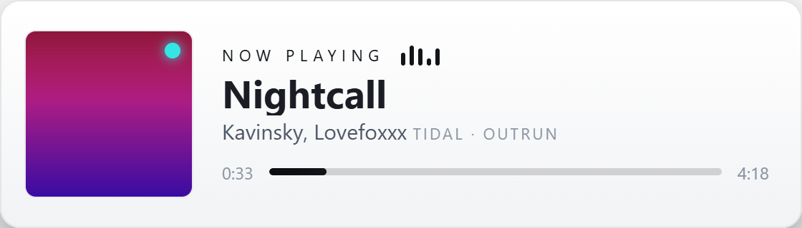

# Re-skinning Cadence

The widget is a **theme-agnostic renderer**: the entire look is driven by a set of CSS
**custom properties** (variables) declared in one `:root` block. Re-skinning is just
overriding those — **no JavaScript, no layout surgery**. Change ~6 for a client's
palette; a few more for a distinct look.

There are three levels, easiest first:

1. **[The 60-second reskin](#the-60-second-reskin)** — override the color/font variables.
2. **[Ship a client theme](#shipping-a-client-theme)** — a pre-configured, pre-branded copy.
3. **[Build a fully custom renderer](#advanced-a-fully-custom-renderer)** — reuse the data
   adapter, draw your own HTML.

---

## The 60-second reskin

Open `now-playing-560x160.html`, find the `:root { … }` block near the top of the
`<style>`, and change the variables. That's it — save and refresh the source.

For example, this warm-gold theme is **eight lines**:

```css
:root {
  --bg-1:  #1a1408;
  --bg-2:  #0d0a04;
  --border:#4a3b1e;
  --text:  #f5ecd8;
  --sub:   #d8c9a6;
  --muted: #9c8a63;
  --accent:#e6b84f;
  --art-bg:#2a2110;
}
```

| Default (teal) | Luxe Gold | Mono Light |
|---|---|---|
|  |  |  |

Same widget, same markup — only the variables changed.

## Variable reference

Everything you can restyle, and what it controls:

| Variable | Controls | Default |
|---|---|---|
| `--bg-1` / `--bg-2` | Card background gradient (top / bottom) | `#171c26` / `#0e1218` |
| `--border` | Card border | `#2a3444` |
| `--text` | Track title + primary text | `#eef2f7` |
| `--sub` | Artist / album line | `#c4cdda` |
| `--muted` | Timestamps, the source chip, faint text | `#8593a6` |
| `--accent` | Eyebrow ("NOW PLAYING"), progress fill, equalizer bars, default dot | `#57c9e6` |
| `--art-bg` | Album-art tile background + the no-art fallback icon | `#1b2331` |
| `--radius` | Corner radius of the card and the art tile | `14px` |
| `--font` | Font for all text | system UI stack |
| `--title-font` | Font for just the track title (defaults to `--font`) | `var(--font)` |
| `--dot-tidal` `--dot-vlc` `--dot-spotify` `--dot-deezer` `--dot-ytmusic` `--dot-apple` `--dot-amazon` | The little "source" dot per service | brand-ish colors |

> Tip: the accent is used in several places (eyebrow, bars, progress, fallback default
> dot), so changing just `--accent` + the two `--bg` values already reads as a new theme.

## Fonts

Change `--font` (and optionally `--title-font` for a display face on the title):

```css
:root {
  --font: 'Inter', system-ui, sans-serif;
  --title-font: 'Playfair Display', Georgia, serif;
}
```

**OBS + web fonts:** an OBS Browser Source is a Chromium instance, but it can be flaky
loading fonts from a CDN (offline/cache). Two safe options:

- Keep it to **system fonts** (Segoe UI, Arial, Georgia, etc.) — zero risk.
- **Embed** a web font as a `@font-face` with a base64 `data:` URL right in the file, so
  there's no network dependency. (Don't hot-link Google Fonts in a shipped overlay.)

## Per-source dots

The colored dot on the album art reflects the source. Override any of the `--dot-*`
variables to match a client's palette, e.g. `--dot-tidal: #00d1ff;`. Which dot shows is
chosen by the `source` value (`window.__NP.source` or `?source=`).

## Layout tweaks

The canvas is **560×160**. A few safe adjustments:

- **Corner radius:** `--radius` (card + art).
- **Album-art size:** edit `.art { width; height; }` (default `118px`); keep it square.
- **Different dimensions:** change `.stage { width; height; }` **and** the OBS source
  size to match. The layout is flexbox, so it reflows, but very different aspect ratios
  may need spacing tweaks.

Everything visual lives in the single `<style>` block — there are no external stylesheets.

## Shipping a client theme

For client work, deliver a **pre-configured, pre-branded copy** so they just drop it in:

1. Copy `now-playing-560x160.html` to e.g. `now-playing-<client>.html` (keep `client/tuna.js`
   alongside it — the widget loads it relatively).
2. Set the client's palette in `:root` (and `--dot-*` if needed).
3. Set the client's setup in the `window.__NP` block (`source`, `tunaPort`).
4. Hand them the file + `client/` folder. They add it as a **Local File** browser source
   at 560×160. No query strings, no accounts.

## Advanced: a fully custom renderer

If you want a completely different layout (vertical card, huge art, ticker, etc.), you
don't need to touch the data plumbing — reuse `client/tuna.js` and just implement the
render contract. Define `window.setNowPlaying` (and optionally `window.__musicGoLive`)
before loading the adapter, and the adapter will call it:

```js
window.setNowPlaying({
  title:    'Bury the Light',   // string
  artist:   'Casey Edwards',    // string (Tuna's artists[] joined)
  album:    '',                 // string (may be '' — some sources omit it)
  source:   'Tidal',            // label; '' for none
  dot:      '#33e5e5',          // optional explicit dot color (else derived from source)
  art:      'http://127.0.0.1:1608/cover.png?ck=…', // cover URL, or '' for none
  duration: 580,                // seconds
  elapsed:  46,                 // seconds — authoritative correction; omit to keep ticking
  playing:  true,               // gates the local progress tick (freeze when paused)
});

// Called once, on the first real track — use it to stop any demo/idle animation.
window.__musicGoLive = function () { /* … */ };
```

Notes for a custom renderer:
- **Tick `elapsed` yourself** every second while `playing` (SMTC only reports position
  on play/pause/seek — the adapter already extrapolates, but between polls you advance it).
- **De-dupe the cover** by URL and swap to a fallback on `img.onerror` (covers can arrive
  a poll late).
- The bundled renderer does all of this in ~90 lines of vanilla JS inside
  `now-playing-560x160.html` — copy from it.

That's the whole surface. Everything else — Tuna, SMTC, progress extrapolation, source
detection — stays exactly as-is under any skin.
